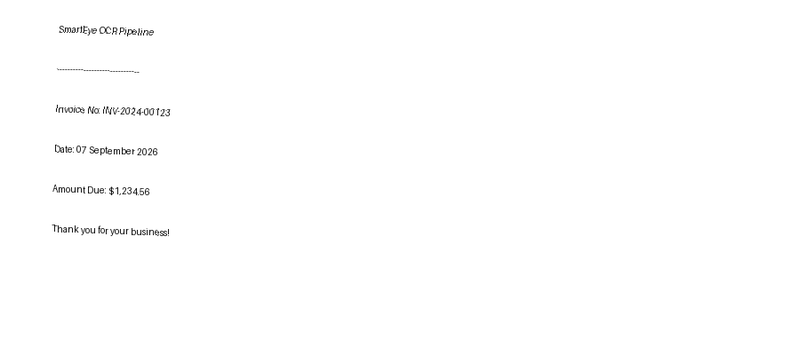
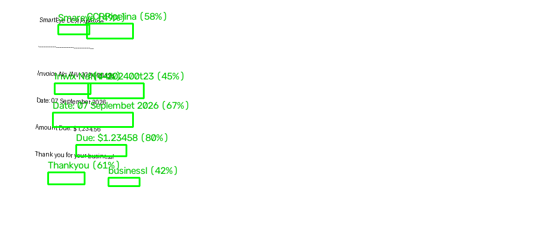

# PixelScript

A Python OCR pipeline that takes an image as input, preprocesses it with OpenCV, and extracts text using **EasyOCR** (printed) or **Microsoft TrOCR** (handwritten).

---

## Approach

The pipeline is split into three focused layers:

1. **Preprocessing** (`ocr/preprocessor.py`) — OpenCV chain: bicubic resize → grayscale → Non-Local Means denoise → adaptive/Otsu binarization (or CLAHE for handwriting) → moment-based deskew → border padding. Each step is independently togglable.

2. **Extraction** (`ocr/extractor.py` / `ocr/handwriting.py`) — Two engines:
   - **EasyOCR** for printed/typed text: detects bounding boxes, filters by confidence threshold, returns `TextRegion` objects with text + bbox + confidence.
   - **TrOCR** (Vision Transformer) for handwriting: segments the image into text-line strips via connected-component analysis, then runs `microsoft/trocr-base-handwritten` on each strip.

3. **Pipeline** (`ocr/pipeline.py`) — Orchestrates preprocessing → extraction → annotated image output. A single `handwriting=True` flag switches the entire engine and preprocessing mode.

**Why these tools?**
- OpenCV for preprocessing: zero-dependency, battle-tested, fast.
- EasyOCR: works out-of-the-box with no binary installs (unlike Tesseract), supports 80+ languages.
- TrOCR: the only widely-available model fine-tuned specifically on handwriting (IAM dataset); it sees greyscale pixels rather than binarized images, which is critical for cursive strokes.

---

## Sample Input / Output

### Printed text

**Input** (`examples/input_printed.png`):



**Output** — annotated with detected bounding boxes (`examples/output_printed_annotated.png`):



**Terminal output:**
```
------------------------------------------------------------
SmartEye OCR Pipeline
Invoice No: INV-2024-00123
Date: 07 September 2026
Amount Due: $1,234.56
Thank you for your business!
------------------------------------------------------------

6 region(s) | avg confidence 85.3%
```

### Handwritten text

```bash
python main.py samples/handwriting_sample.png --handwriting
```
```
------------------------------------------------------------
Meeting notes - 7th September 2026
Action items:
  1. Review OCR pipeline output
  2. Test on real handwritten scans
Total budget: $4,200
Signed: A. Developer
------------------------------------------------------------

7 line(s) detected via TrOCR
```

---

## Project layout

```
PixelScript/
├── ocr/
│   ├── __init__.py          # public API
│   ├── preprocessor.py      # OpenCV preprocessing chain
│   ├── extractor.py         # EasyOCR wrapper + dataclasses
│   ├── handwriting.py       # TrOCR handwriting extractor
│   └── pipeline.py          # orchestration (printed + handwriting)
├── tests/
│   ├── test_preprocessor.py
│   └── test_handwriting_preprocessor.py
├── scripts/
│   ├── generate_sample.py             # generate synthetic printed image
│   └── generate_handwriting_sample.py # generate synthetic handwriting image
├── examples/                # committed sample input + annotated output
├── samples/                 # drop your own images here (gitignored)
├── results/                 # annotated outputs (gitignored)
├── main.py                  # CLI entry point
└── requirements.txt
```

---

## Setup

```bash
# 1. Create venv (--system-site-packages reuses any existing torch install)
python -m venv .venv --system-site-packages

# Windows
.venv\Scripts\activate
# macOS / Linux
source .venv/bin/activate

# 2. Install dependencies
pip install -r requirements.txt
```

> **Note:** EasyOCR downloads models (~100 MB) on first run to `~/.EasyOCR/`.  
> TrOCR downloads its model (~400 MB) on first run to `~/.cache/huggingface/`.

---

## Usage

```bash
# Printed text (EasyOCR)
python scripts/generate_sample.py
python main.py samples/sample.png

# Handwritten text (TrOCR)
python scripts/generate_handwriting_sample.py
python main.py samples/handwriting_sample.png --handwriting

# JSON output
python main.py samples/sample.png --json

# Key flags
#   --confidence 0.6          filter low-confidence regions
#   --binarize otsu           switch binarizer
#   --no-deskew               skip rotation correction
#   --debug                   save per-step preprocessing images
#   --lang en fr de           multi-language (EasyOCR mode)
#   --trocr-model microsoft/trocr-large-handwritten   higher-accuracy model
#   --gpu                     use CUDA if available
```

---

## Programmatic API

```python
from ocr import OCRPipeline
from ocr.preprocessor import PreprocessConfig

# Printed
pipeline = OCRPipeline(languages=["en"], confidence_threshold=0.4)
result = pipeline.run("samples/invoice.png")
print(result.raw_text)

# Handwritten
pipeline = OCRPipeline(handwriting=True)
result = pipeline.run("samples/note.png")
print(result.raw_text)
```

---

## Preprocessing chain

| Step | Printed mode | Handwriting mode |
|------|-------------|-----------------|
| Resize | Bicubic upscale if < 1000 px wide | same |
| Grayscale | BGR → single channel | same |
| Denoise | `fastNlMeansDenoising` (h=10) | h=5 (lighter) |
| Binarize | Adaptive Gaussian **or** Otsu | **CLAHE** (preserves stroke gradients) |
| Deskew | Moment-based, up to ±45° | same |
| Border | 20 px white padding | same |

---

## Tests

```bash
pytest tests/ -v   # 12 tests, all pass
```

---

## Supported languages (EasyOCR mode)

`en` · `fr` · `de` · `es` · `ch_sim` · `ar` · [80+ more](https://www.jaided.ai/easyocr/)
